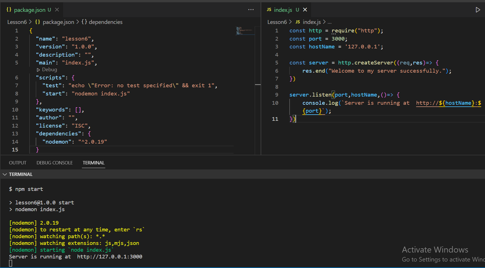

### node.js-basics

- front end + back end = full stack
- client side + server side + database

#### What is Node.js
- server environment; not a programming language
- runs on various platforms (Windows, Linux, Mac OS etc.)
- it's free

#### Why learn Node.js
- easy to learn
- it uses asynchronous programming. Which is different than PHP, ASP
- used for collecting form data
- Node.js can add, delete, modify data in your database

#### Environment setup
- Node.js software install in your computer
- Editor (VS Code or others)

#### Node version check
```javascript
node -version
or,
node -v
```

#### Node.js Modules
- Module is a set of functions. (linke as js libraries such as Math)
- 3 types of modules
1. Local Modules (own created modules)
2. Built in Modules (node.js own modules) - http, url, path, fs, os, events, stream, dns etc.  [No need to install].
[Built in Modules](https://www.w3schools.com/nodejs/ref_modules.asp)

3. External Modules (managed by npm)


#### Local Module

- student.js file
```javascript
const getName = () => {
    return "Ami faisal";
}

const getAge = () => {
    return "25";
} 

const cgpa = 3.79;

// exports.getName = getName;
// exports.getAge = getAge;
// exports.result = cgpa;

module.exports = {
    getName,
    getAge,
    cgpa
}

```

- teacher.js file
```javascript
const subject = () => {
    return "CSE";
}

const degree = () => {
    return "PHD";
}


module.exports = {
    subject, degree
}
```

- professor.js file
```javascript
exports.profession = () => {
    return "Teaching";
}
```


- index.js file
```javascript
console.log("Local Module");

// import all object together
const s1 = require('./student');

// import single object from many
const { degree } = require('./teacher');

const { profession } = require('./professor')


console.log(s1.getName());
console.log(s1.getAge());
console.log(s1.cgpa);


console.log(degree());
console.log(profession());
```


#### Built in Module
##### fs module
`Fs means file system`
`fs module have many methods like as:`
- writeFile()  ||  writeFileSync()
- appendFile()  || appendFileSync()
- readFile()  ||  readFileSync()
- rename()  ||  renameSync()
- unlink()  ||  unlinkSync()
- exists()  || existsSync()

```javascript
const fs = require('fs');
// console.log(fs);

fs.writeFile("demo1.txt", "My name is Faisal Ahmed", (error) => {
    if (error) {
        console.log(error);
    }
    else {
        console.log("data write successfull. ");
    }
})

fs.appendFile("demo1.txt", " And I am trying to learn node.js", (error) => {
    if (error) {
        console.log(error);
    }
    else {
        console.log("data update successfull");
    }
})


fs.readFile("demo1.txt", 'utf-8', (error, data) => {
    if (error) {
        console.log(error);
    }
    else {
        console.log(data);
    }
})


fs.rename("demo1.txt", "demo2.txt", (error) => {
    if (error) {
        console.log(error);
    }
    else {
        console.log("file rename successfull.");
    }
})

fs.unlink("demo2.txt", (e)=> {
    if(e){
        console.log(e);
    }
    else {
        console.log("file deleted successfully.");
    }
})


fs.exists("demo2.txt", (result)=> {
    if(result){
        console.log("file found");
    }
    else {
        console.log("file not found");
    }
})


// for syncronous : 
// - use syncronous fs library like fs.writeFileSync, fs.readFileSync etc.
// - remove callback function

```


##### os module
`OS module means operating system`
`OS module provides information about the computer's operating system. `
```javascript
// os 
// OS module provides information about the computer's operating system. 
const os = require('os');
const { totalmem, freemem } = require('os');

// console.log(os);
console.log(os.userInfo());
console.log(os.homedir());
console.log(os.hostname());
console.log(totalmem());
console.log(freemem());
```


##### path module
`The Path module provides a way of working with directories and file paths.`


`__dirname and  __filename`
```javascript
console.log(__dirname);
console.log(__filename);
```


```javascript
// path module 
const path = require('path');
// console.log(path);

const extensionName = path.extname("index.html");
console.log(extensionName);

const joinName = path.join(__dirname + '/practice');
console.log(joinName);

const joinName2 = path.join(__dirname + '/../views');
console.log(joinName2);
```


##### http module
`To create http server`


- To createHttp server
```javascript
const http = require('http');
// console.log(http);

// first way 
http.createServer((req, res) => {
    res.end("hello, I am your first server.")
}).listen(1000);

// second way 
http.createServer((req, res) => {
    res.end("hi!, We are your first server.")
}).listen(2000, () => {
    console.log("Server running successfully.");
})

// third way 
const port = 3000;
const myServer = http.createServer((req, res) => {
    res.end("Yah! you are server.")
});

myServer.listen(port, () => {
    console.log("Yah! Server running successfully at port " + port);
})

// fourth way
const ourPort = 4000;
const hostname = '127.0.0.1';
const ourServer = http.createServer((req, res)=> {
    res.end("<h1>Our server run happily.</h1>");
})

ourServer.listen(ourPort,()=> {
    console.log(`Our server run at http://${hostname}:${ourPort}`);
})

```


##### For request to the server, there are some common methods: 
- get()
- post()
- delete()
- put()
- head()

##### In response, we will get two things:
- status code
- data(head and body)

##### HTTP status code:
1. informational response(100-199)
2. successful response(200-299)
3. redirects(300-399)
4. client errors(400-499)
5. server errors(500-599)

- set (status code and data) on head
```javascript
const http = require("http");

const port = 3000;
const hostname = '127.0.0.1';

// 'Content':'Type':'text/plain' 
const myServer = http.createServer((req, res)=> {
    res.writeHead(200, {'Content-Type': 'text/plain'});
    res.write("Hello my world");
    res.write("\n");
    res.write("Hello my world2");
    res.end();
})

myServer.listen(port,()=> {
    console.log(`My server run at http://${hostname}:${port}`);
})

// 'Content':'Type':'text/html'
const port2 = 4000;
const hostname2 = '127.0.0.1';

const ourServer = http.createServer((req,res)=> {
    res.writeHead(201,{'Content-Type':'text/html'});
    res.write('<h4>Hello, Hi<h4>');
    res.write('<h4>Hello2, Hi2<h4>');
    res.end();
});
ourServer.listen(port2,hostname2,()=> {
    console.log(`Our msg runs at http://${hostname2}:${port2}`);
})

```


#### External Modules
`package example:`
- random-fruits-name
- nodemon

`How to use external modules/ packages`
- firstly, initialized the npm (npm init or npm init -y)
- then, install packages and read documentation


- package.json এর কাজ হচ্ছে সম্পূর্ণ প্রজেক্ট এর একটা সামারি রাখা। এই প্রজেক্ট টা যদি অন্য কোনো প্যাকেজ এর উপর নির্ভর করে, তবে তাকে package.js এ ডিপেন্ডেন্সি হিসেবে রাখবে।  


```javascript
// random-fruits-name external packages
const randomFruitsName = require('random-fruits-name');
// console.log(randomFruitsName('en'));


// name-to-imdb external packages
var nameToImdb = require("name-to-imdb");
nameToImdb("3 idiots", function(err, res, inf) { 
  console.log(res); // "tt0121955"
  // inf contains info on where we matched that name - e.g. metadata, or on imdb
  // and the meta object with all the available data
  console.log(inf);
})
```


#### Nodemon
##### How to install and run nodemon package
- `npm install nodemon`

- and also set `"start": "nodemon index.js"` in scripts file in package.json

- and final scripts in package.json file looks like this image:
```javascript
"scripts": {
    "test": "echo \"Error: no test specified\" && exit 1",
    "start": "nodemon index.js"
  },
```

- full index.js file and package.json file image below there:
<p align='center'>
  
</p>

---

#### http routing

```javascript
const http = require("http");
const fs = require("fs");
const port = 3000;
const hostName = '127.0.0.1';

const server = http.createServer((req, res) => {

    const handleReadFile = (fileLocation, statusCode) => {
        fs.readFile(fileLocation, (err, data) => {
            res.writeHead(statusCode, { 'Content-Type': 'text/html' });
            res.write(data);
            res.end();
        })
    }

    if (req.url === '/') {
        handleReadFile('./views/index.html', 200);
    }
    else if (req.url === '/contact') {
        handleReadFile('./views/contact.html', 200);
    }
    else if (req.url === '/about') {
        handleReadFile('./views/about.html', 200);
    }
    else {
        handleReadFile('./views/error.html', 200);
    }
})

server.listen(port, hostName, () => {
    console.log(`Server is running at  http://${hostName}:${port}`);
})
```
